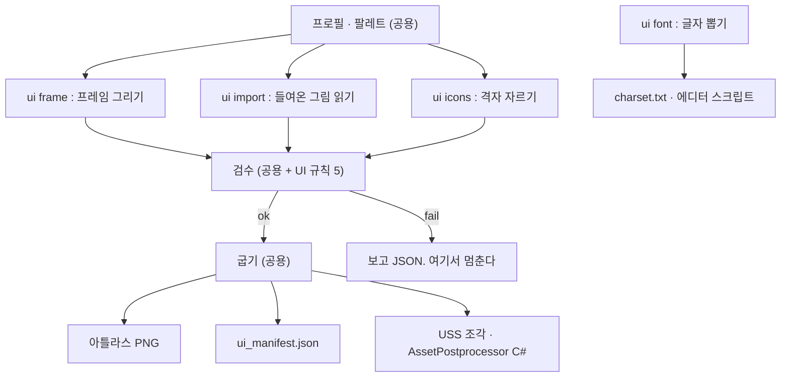

# UI 툴 설계 — 9-slice · 폰트 · 레이아웃

> 입력값 : `Docs/Research/2026-08-25-UI툴조사.md`(결정 후보 9개 · 정해야 할 것 10개), `Docs/Design/2026-08-25-그림툴설계.md`(툴 하나 · 명령 묶음 · 공용 계층).
> **앞선 설계 문서는 안 고쳤다.** 이 문서는 거기 비워 둔 "UI 명령" 자리를 채운다.

## 결론 먼저 (여섯 줄)

1. **UI 툴은 새 툴이 아니다.** `arttool ui …` **명령 묶음** + 프로필의 `ui:` 절이다. 프로필·팔레트·검수·굽기는 그대로 쓴다.
2. **border 는 뽑는 게 아니라 아는 값이다.** 프레임을 코드가 그리므로 **그릴 때 border 를 같이 적는다.** 자동 판별(OnionRing)은 안 쓴다.
3. **레이아웃은 UI Toolkit 하나만.** 화면 정의 JSON → UXML + USS. uGUI 길은 안 연다.
4. **배율은 코드가 정수로 계산한다.** `Screen Space - Overlay` + `floor(화면높이 / 기준높이)`.
5. **폰트는 갈무리(OFL-1.1).** 글자 서브셋 뽑기는 툴(Python), TMP 폰트 에셋 굽기는 **동봉하는 Unity 에디터 스크립트**가 한다.
6. **UI 는 64×64 캔버스를 안 쓴다.** 프레임 원본 16, 아이콘 16, PPU 16, 기준 해상도 320×180 이 프로필 기본값이다.

## 1. UI 툴의 자리

### 1-1. 무엇이 새로 붙나

앞선 설계에서 UI 는 "경계만 긋고 안은 비워 둔" 자리였다. 채우면 이렇게 된다.

| 부품 | 어디 것 | UI 가 하는 일 |
| --- | --- | --- |
| 프로필 읽기 · 프리셋 겹치기 | 공용 (`profile.py`) | `ui:` 절만 추가 |
| 팔레트 램프 스냅 · 색 수 검사 | 공용 (`palette.py`) | 그대로 |
| 격자 자르기 | 공용 (`image.py`) | 아이콘 시트 자르기에 그대로 |
| 검수 | 공용 (`check.py`) | UI 전용 규칙 5개만 더한다 |
| 굽기 (아틀라스 · 매니페스트 · 임포터) | 공용 (`bake.py`) | 매니페스트에 `border` 칸이 는다 |
| **9-slice border** | **UI 만** | 프레임 생성기가 같이 낸다 |
| **폰트 (서브셋 · TMP)** | **UI 만** | 툴은 글자 목록까지, 굽기는 Unity 에디터 |
| **레이아웃 (JSON → UXML/USS)** | **UI 만** | 1차는 최소 형태 |

스프라이트가 **시간**으로, 타일이 **공간**으로 이어진다면 UI 는 **크기**로 늘어난다. 그래서 앵커도 47-blob 도 안 탄다.



### 1-2. 안 하는 것

**아이콘 그리기**(밖에서 들어온다) · **자동 border 판별**(2절) · **uGUI 프리팹 굽기**(검수가 두 배가 된다).

## 2. border 를 어떻게 아나

**순서가 있다. 위가 이기고, 아래로 갈수록 못 미덥다.**

| 순위 | 방식 | 언제 쓰나 | 믿을 만한가 |
| --- | --- | --- | --- |
| **1** | **프레임 생성기가 그리면서 같이 적는다** | 패널 · 버튼 · 바 — 우리가 만드는 것 전부 | **확실.** 그린 규칙에서 계산한 값이다 |
| **2** | `.9.png` 안내선을 읽는다 | 밖에서 들어온 그림 | 확실. 그림 파일이 규격을 들고 온다 |
| 3 | 프로필에 손으로 적기 | 안내선도 없는 낱장 | 사람이 적은 값이라 틀릴 수 있다 |
| ❌ | 자동 판별(OnionRing) | — | **안 쓴다.** 픽셀아트는 줄이 짧고 디더링이 섞여 오판이 잦다 |

`.9.png` 규약은 **원본 바깥에 1px 테두리**를 두르고 검은 점으로 긋는다.

| 테두리 자리 | 검은 구간이 뜻하는 것 | 툴이 쓰는가 |
| --- | --- | --- |
| 위 | 가로로 늘어나는 구간 | ✅ `border.left` = 구간 시작, `border.right` = 원본폭 − 구간 끝 |
| 왼쪽 | 세로로 늘어나는 구간 | ✅ `border.top` · `border.bottom` |
| 아래 · 오른쪽 | 글자가 들어가는 안쪽 영역 | ⚠️ 읽어서 `content_padding` 에 넣는다. 없으면 border 와 같게 본다 |

들여올 때 안내선 1px 을 **떼어 낸 PNG** 를 따로 저장한다. 원본 파일은 안 고친다.

## 3. 프로필 `ui:` 절

기존 프로필 예시(`profiles/topdown_action.yaml`)에 **아래 덩이를 통째로 덧붙인다.** 다른 절은 안 건드린다.

```yaml
ui:
  ppu: 16                      # 이 값이 slice-scale 을 정한다
  reference: [320, 180]        # 기준 해상도. 16:9, 1080p 의 정확히 6배
  scale_mode: integer          # floor(화면높이 / 기준높이). 이것만 지원
  letterbox: true              # 남는 자리는 늘리지 말고 검게 둔다

  frame:                       # 9-slice 로 늘어나는 것 (패널·버튼·바)
    source: [16, 16]
    even_only: true            # 홀수 폭·높이 금지 (반픽셀 방지)

  icon:
    sizes: [16, 32]            # 이 밖 크기는 검수 실패
    sheet: { cell: 16, margin: 0, spacing: 2 }   # Kenney Pixel UI Pack 격자
    hotspot: center            # 커서용. center | top_left | 픽셀 좌표

  generator:
    border_px: 1               # 바깥 테두리 두께
    corner: cut1               # square | cut1 | cut2 (픽셀아트에 반지름은 없다)
    highlight: 1               # 위·왼쪽 안쪽 밝은 줄
    inner_shadow: 1            # 아래·오른쪽 안쪽 어두운 줄
    ramp: ui_panel
    ramp_index: { outline: 5, highlight: 1, fill: 3, shadow: 4 }  # 0 = 가장 밝음
    states: [normal, pressed, disabled]

  font:
    family: Galmuri11          # 갈무리. OFL-1.1
    native_px: 11              # 이 폰트가 또렷한 고유 크기
    sizes_px: [11, 22]         # 고유 크기의 정수 배수만
    subset:
      scan_dirs: [Text/]
      extensions: [.txt, .json, .csv]
      always: "0123456789.,!?%:()+-/ "   # 대사에 없어도 꼭 넣을 글자
      atlas_max: 2048          # 넘으면 검수 경고

  check:
    min_size_slack: 1          # 가운데 칸이 최소 1px 은 남아야 한다
    palette_strict: true
    allow_alpha: binary        # 반투명 픽셀 금지
    require_even: true
```

**값이 정해지는 순서는 기존 그대로다** — 툴 기본값 → 프리셋 → 프로필 → CLI 인자. `ui:` 도 같은 규칙을 탄다.

## 4. 파이프라인

기존 4단(규격 → 뽑기 → 검수 → 굽기)과 같은 자리다. "앵커 뽑기" 칸에 "프레임 그리기 / border 읽기" 가 들어간다.

| 단계 | 명령 | 입력 | 출력 | 실패 조건 |
| --- | --- | --- | --- | --- |
| ①ㄱ 프레임 그리기 | `ui frame` | 프로필 `ui.generator`, 팔레트 램프 | 상태별 PNG(`panel_normal.png` …) + `border.json` | 램프에 단이 모자람 · 최소 크기 > 원본 크기 · 원본이 홀수 |
| ①ㄴ 들여오기 | `ui import` | `.9.png` 또는 낱장 PNG | 안내선 뗀 PNG + `border.json` | 안내선이 네 변에 안 맞음 · 검은 구간이 2개 이상 · 안내선 없음(3순위로 안 내려감) |
| ①ㄷ 아이콘 자르기 | `ui icons` | 아이콘 시트 PNG, 격자 값 | 낱장 PNG 폴더 + `icons.json` | 칸 크기가 `icon.sizes` 밖 · 격자가 시트 크기와 안 맞음 |
| ② 검수 | `ui check` | ①의 산출물, 프로필 `ui.check` | 검수 보고 JSON | 아래 6줄 중 하나라도 걸림 |
| ③ 굽기 | `ui bake` | ②가 `ok` 인 것 | 아틀라스 PNG · `ui_manifest.json` · `.uss` 조각 · `UiImportSettings.cs` | 보고가 `ok` 가 아님 |
| (곁가지) 글자 뽑기 | `ui font` | `subset.scan_dirs` 아래 텍스트 | `charset.txt` + `TmpFontBaker.cs` | 훑을 폴더가 없음 · 글자 0개 |

**③은 ②가 `ok` 일 때만 돈다.** `--force` 를 대놓고 적으면 매니페스트에 `forced: true` 가 박힌다 — 기존 규칙 그대로다.

### 4-1. UI 검수 규칙 여섯

| # | 규칙 | 계산 | 걸리면 |
| --- | --- | --- | --- |
| 1 | **최소 크기** | `min_w = left + right + slack`, `min_h = top + bottom + slack` | 실패. 매니페스트에 값을 같이 굽는다 |
| 2 | **짝수 크기** | `w % 2 == 0 and h % 2 == 0` | 실패 (`require_even` 이 켜졌을 때) |
| 3 | **팔레트 밖 색** | 램프에 없는 RGB 가 1픽셀이라도 있나 | 실패 (`palette_strict`) |
| 4 | **반투명** | 알파가 0 도 255 도 아닌 픽셀 | 실패. 안티에일리어싱이 섞였다는 뜻 |
| 5 | **상태 갖춤** | `states` 목록의 PNG 가 다 있나 | 실패. 눌림만 빠지는 사고가 흔하다 |
| 6 | **PPU 대조** | 구워 둔 `ui_manifest.json` 의 `ppu` 가 프로필 `ui.ppu` 와 같나 | 실패. 매니페스트가 아직 없으면 지나간다 (8-3) |

경고(멈추지 않음) 둘 : 아틀라스가 `atlas_max` 를 넘음 · 아이콘 크기가 `sizes` 안이지만 가족이 섞임.

## 5. 프레임 생성기

**같은 프로필 + 같은 팔레트면 언제 돌려도 같은 픽셀이 나와야 한다.** 그래서 난수도, 부동소수 반올림도 안 쓴다.

### 5-1. 그리는 순서 (위에서 아래로 덮어쓴다)

| 순서 | 무엇 | 규칙 |
| --- | --- | --- |
| 1 | 바탕 | 전체를 `ramp_index.fill` 로 채운다 |
| 2 | 바깥 테두리 | 가장자리에서 안쪽으로 `border_px` 만큼을 `outline` 으로 |
| 3 | 모서리 깎기 | `corner` 값만큼 네 귀퉁이를 **대각선으로 투명하게** 지우고, 깎인 자리 바로 안쪽에 `outline` 을 다시 긋는다 |
| 4 | 하이라이트 | 테두리 **안쪽** 위·왼쪽 `highlight` 줄을 `ramp_index.highlight` 로 |
| 5 | 안쪽 그림자 | 테두리 **안쪽** 아래·오른쪽 `inner_shadow` 줄을 `ramp_index.shadow` 로 |
| 6 | 겹치는 칸 | 하이라이트와 그림자가 만나는 칸은 **그림자가 이긴다** (아래·오른쪽이 나중) |
| 7 | border 계산 | `left = right = corner + border_px + max(highlight, inner_shadow)` — 위·아래도 같다 |

- 광원은 **좌상단 고정**이다. 위·왼쪽이 밝고 아래·오른쪽이 어둡다.
- `corner: cut1` 은 귀퉁이 1픽셀, `cut2` 는 계단 2픽셀(가로 2 · 세로 1 이 아니라 **정확한 대각 2칸**)이다.
- 반지름 개념은 안 쓴다. 픽셀아트에서 반지름은 결국 깎는 칸 수다.
- **크기 계산 예** : 원본 16×16 · `border_px 1` · `cut1` · 하이라이트 1 · 그림자 1 → `border = [3,3,3,3]`, 최소 크기 7×7, 가운데 늘어나는 칸 10px.

### 5-2. 상태 변형

| 상태 | 규칙 | border 가 바뀌나 |
| --- | --- | --- |
| `normal` | 5-1 그대로 | — |
| `pressed` | **하이라이트와 그림자를 맞바꾼다** (위·왼쪽이 어두워진다). 안쪽 내용은 굽는 쪽에서 1px 아래로 민다 | ❌ 같다 |
| `disabled` | 램프를 **회색 램프**로 통째 스왑한다(채도 0, 명도는 램프 순서 유지). 모양은 안 바꾼다 | ❌ 같다 |
| `hover` (2차) | 램프 단을 하나씩 밝은 쪽으로 민다 | ❌ 같다 |

**세 상태의 border 가 같은 것이 중요하다.** 다르면 눌렸을 때 창이 들썩인다.

## 6. `ui_manifest.json`

기계끼리 주고받는 것은 전부 JSON — 기존 결정 그대로다.

```json
{
  "version": 1,
  "profile": "topdown_action",
  "ppu": 16,
  "reference": [320, 180],
  "slice_scale": 6.25,
  "atlas": "ui_atlas.png",
  "frames": [
    { "name": "panel_normal", "rect": [0, 0, 16, 16], "border": [3, 3, 3, 3],
      "min_size": [7, 7], "content_padding": [4, 4, 4, 4], "state": "normal", "group": "panel" },
    { "name": "button_pressed", "rect": [16, 0, 32, 16], "border": [3, 3, 3, 3],
      "min_size": [7, 7], "content_padding": [3, 2, 3, 4], "state": "pressed", "group": "button" }
  ],
  "icons": [
    { "name": "icon_potion", "rect": [0, 16, 16, 32], "size": 16, "family": "item" }
  ]
}
```

| 칸 | 뜻 | 규칙 |
| --- | --- | --- |
| `border` | **[왼, 아래, 오른, 위] 픽셀** | Unity `TextureImporter.spriteBorder` 의 Vector4 순서 그대로다. 순서를 바꾸지 않는다 |
| `min_size` | 이보다 작게 늘리면 안 되는 크기 | `[left+right+slack, top+bottom+slack]` |
| `content_padding` | 글자가 들어갈 안쪽 여백 | `.9.png` 의 아래·오른쪽 안내선. 없으면 `border` 와 같다 |
| `slice_scale` | USS `-unity-slice-scale` 에 넣을 값 | **`100 / ppu`**. PPU 16 이면 6.25 다 |
| `rect` | 아틀라스 안 자리 | `[x1, y1, x2, y2]`, 왼쪽 위 기준 |
| `state` · `group` | 상태와 묶음 | 같은 `group` 안에서 `border` 가 다르면 굽기가 오류를 낸다 |

## 7. 화면 정의 JSON → UXML + USS

**1차는 최소 형태만 한다** — 세로/가로 쌓기 · 여백 · 9-slice 배경 · 라벨. 그 밖(격자·스크롤·목록·전환)은 2차다.

### 7-1. 스키마 (최소)

| 칸 | 값 | 뜻 |
| --- | --- | --- |
| `id` | 문자열 | 코드가 `Q<VisualElement>("id")` 로 찾는 이름. 화면 안에서 안 겹쳐야 한다 |
| `type` | `column` · `row` · `panel` · `label` · `button` · `icon` · `spacer` | 이 일곱뿐이다 |
| `bg` | 매니페스트의 `frames[].name` | 있으면 9-slice 배경을 깐다 |
| `text` | 문자열 | `label` · `button` 만 |
| `pad` | 정수 또는 [상,우,하,좌] | **기준 해상도 픽셀 단위** |
| `gap` | 정수 | 자식 사이 간격 |
| `size` | `[가로, 세로]` 또는 `auto` | 픽셀 단위 |
| `grow` | 참/거짓 | 남는 자리를 먹는다 (`flex-grow: 1`) |
| `children` | 배열 | `column` · `row` · `panel` 만 가진다 |

```json
{
  "screen": "pause_menu",
  "root": {
    "id": "root", "type": "column", "pad": 8, "gap": 4, "bg": "panel_normal", "size": [120, 80],
    "children": [
      { "id": "title", "type": "label", "text": "멈춤" },
      { "id": "btn_resume", "type": "button", "text": "이어하기", "bg": "button_normal" },
      { "id": "spacer", "type": "spacer", "grow": true },
      { "id": "btn_quit", "type": "button", "text": "나가기", "bg": "button_normal" }
    ]
  }
}
```

### 7-2. 나오는 UXML

```xml
<ui:UXML xmlns:ui="UnityEngine.UIElements">
  <ui:VisualElement name="root" class="ui-column bg-panel_normal">
    <ui:Label name="title" text="멈춤" class="ui-label" />
    <ui:Button name="btn_resume" text="이어하기" class="ui-button bg-button_normal" />
    <ui:VisualElement name="spacer" class="ui-spacer" />
    <ui:Button name="btn_quit" text="나가기" class="ui-button bg-button_normal" />
  </ui:VisualElement>
</ui:UXML>
```

### 7-3. 나오는 USS 조각

```css
.ui-column { flex-direction: column; padding: 8px; }
.ui-column > * { margin-bottom: 4px; }
.ui-spacer  { flex-grow: 1; }
.ui-label   { -unity-font-definition: url("/Assets/UI/Fonts/Galmuri11 SDF.asset"); font-size: 11px; }

.bg-panel_normal {
  background-image: url("/Assets/UI/ui_atlas.png#panel_normal");
  -unity-slice-left: 3;  -unity-slice-bottom: 3;
  -unity-slice-right: 3; -unity-slice-top: 3;
  -unity-slice-scale: 6.25;   /* 100 / ppu(16). 안 적으면 테두리가 사라진다 */
  min-width: 7px; min-height: 7px;
}
```

- **`-unity-slice-scale` 을 툴이 반드시 적는다.** 빠뜨리면 테두리가 사라지는데 원인을 찾기 어렵다.
- 클래스 이름은 `ui-<type>` · `bg-<프레임이름>` 둘뿐이라 코드가 그대로 만든다.
- **UXML 은 배선을 안 담는다.** 버튼 동작은 `Q<Button>("btn_resume").clicked += …` 로 코드에 둔다 (AGENTS 10절).

## 8. Unity 쪽 산출물

| 산출물 | 누가 쓰나 | 하는 일 |
| --- | --- | --- |
| `ui_atlas.png` + `ui_manifest.json` | `AssetPostprocessor` | 임포터 설정과 `border` 를 넣는다 |
| `UiImportSettings.cs` (툴이 생성) | Unity 에디터 | 아래 8-1 |
| `TmpFontBaker.cs` (툴이 동봉) | Unity 에디터 메뉴 | 아래 8-2 |
| `*.uss` · `*.uxml` | 런타임 | 7절 산출물 |
| `charset.txt` | `TmpFontBaker` | 서브셋에 넣을 글자 목록 |
| `UiSpecAsset` (ScriptableObject) | 런타임 코드 | **수치만** — 기준 해상도 · PPU · 배율 규칙 |

### 8-1. `AssetPostprocessor` 가 하는 일

`OnPreprocessTexture` 에서 : `filterMode = Point` · `textureCompression = Uncompressed` · `mipmapEnabled = false` · `spritePixelsPerUnit = ppu` · `spriteMode = Multiple`.
`OnPostprocessTexture` 에서 : `ui_manifest.json` 을 읽어 `ISpriteEditorDataProvider` 로 `SpriteRect` 목록을 만들고 각 `border` 를 채운 뒤 `SetSpriteRects()` → `Apply()` → `SaveAndReimport()`.

**사람이 Sprite Editor 를 열 일이 없다.** 설정이 전부 코드와 JSON 에 있다.

### 8-2. `TmpFontBaker.cs` 가 하는 일

TMP 폰트 에셋은 **Unity 에디터 안에서만** 만들 수 있다. 그래서 일을 둘로 가른다.

| 누가 | 무엇 |
| --- | --- |
| **툴 (Python)** | `scan_dirs` 아래 `.txt` · `.json` · `.csv` 를 UTF-8 로 읽어 **쓰인 글자 집합**을 뽑는다. JSON·CSV 도 그냥 텍스트로 읽는다(키 이름까지 들어가지만 몇 글자 더 드는 게 파서를 갖는 것보다 싸다). `always` 를 합치고 정렬해 `charset.txt` 로 쓴다 |
| **Unity 에디터 스크립트** | `charset.txt` 를 읽어 `Raster Hinted` · `Sampling Point Size = native_px` · `Padding 4` · `Bitmap` 셰이더 · 아틀라스 `filterMode = Point` 로 폰트 에셋을 굽는다 |

메뉴 하나(`Tools/ArtTool/Bake UI Font`)와 배치 모드용 정적 함수 하나를 같이 낸다.

### 8-3. 픽셀아트 함정 여섯 — 어디서 막나

| 함정 | 막는 자리 | 어떻게 |
| --- | --- | --- |
| **PPU 불일치** | 프로필 + 임포터 + USS | 셋이 다 `ui.ppu` 하나에서 나온다. 검수가 매니페스트와 임포터 값을 대조 |
| **모서리가 목표 크기보다 큼** | 검수 규칙 1 + USS | `min_size` 를 계산해 굽고, USS 에 `min-width` · `min-height` 로 박는다 |
| **필터 · 압축** | `AssetPostprocessor` | `Point` · `Uncompressed` · mipmap 끔을 코드가 강제 |
| **UI Toolkit 동적 아틀라스 흐림** | `PanelSettings` 안내 + 굽기 경고 | `DynamicAtlasSettings` 에서 UI 아틀라스를 빼라는 줄을 굽기 보고에 찍는다. **Unity 6 에서 고쳐졌는지 확인 못 했다** |
| **`-unity-slice-scale`** | 굽기 (`uss.py`) | `100 / ppu` 를 계산해 모든 `bg-*` 규칙에 반드시 적는다 |
| **홀수 크기** | 검수 규칙 2 | `require_even` 이 켜져 있으면 홀수 원본은 실패 |

### 8-4. 배율 계산

`Screen Space - Overlay` + `Constant Pixel Size` 에 두고 코드가 `scale = max(1, floor(화면높이 / ui.reference[1]))` 를 넣는다.
정수라 픽셀이 안 깨지고, 남는 자리는 늘리지 말고 레터박스로 둔다.
**월드(Pixel Perfect Camera)와 UI 는 서로 안 엮인다** — Overlay 캔버스는 카메라를 안 거친다. **같은 함수가 둘의 배율을 계산해 맞춰야** 월드 픽셀과 UI 픽셀 크기가 같아 보인다. 그 함수는 `UiSpecAsset` 의 수치를 읽는 코드 한 곳에 둔다.

## 9. 코드 구조

### 9-1. 패키지 (기존 트리에 `ui/` 만 는다)

```
src/arttool/
  cli.py            # 명령 등록만 (기존)
  profile.py        # ui: 절 읽기·검사만 추가
  palette.py  image.py  check.py  bake.py   # 기존 그대로
  sprite/  tiles/  providers/               # 기존 그대로
  ui/
    frame.py        # ①ㄱ 프레임 그리기 + border 계산
    ninepatch.py    # ①ㄴ .9.png 안내선 읽기·떼기
    icons.py        # ①ㄷ 격자 자르기
    check_ui.py     # ② UI 전용 규칙 여섯
    manifest.py     # ui_manifest.json 쓰기·읽기
    screen.py       # 화면 JSON → 트리 검사
    uxml.py         # 트리 → UXML
    uss.py          # 트리 + 매니페스트 → USS (slice-scale 계산)
    font.py         # 글자 집합 뽑기
    unity/          # 내보낼 C# 원본 (템플릿 문자열이 아니라 진짜 .cs 파일)
      UiImportSettings.cs
      TmpFontBaker.cs
```

원칙 셋은 기존과 같다 — `cli.py` 에 로직 없음, Pillow 는 `image.py` 안에서만, `providers/` 밖에서는 제공자 이름을 모름.
여기에 하나 더 : **`ui/` 밖에서는 `border` 를 모른다.** `bake.py` 는 매니페스트 칸을 그대로 옮길 뿐 뜻을 해석하지 않는다.

### 9-2. 명령 꼴

```
arttool ui frame   --profile P --kind panel --size 16x16 --out build/ui/frames/
arttool ui import  --profile P --in raw/ui/ --out build/ui/frames/
arttool ui icons   --profile P --in raw/icons.png --cell 16 --out build/ui/icons/
arttool ui check   --profile P --in build/ui/ --report build/ui/check.json
arttool ui bake    --profile P --in build/ui/ --out Unity/UI/ --namespace Game.UI
arttool ui screen  --profile P --spec screens/pause_menu.json --out Unity/UI/
arttool ui font    --profile P --scan Text/ --out build/ui/charset.txt
```

`--kind` 는 `panel` · `button` · `bar` 셋. 공통 인자(`--profile` · `--dry-run` · `--force` · `--json`)는 기존 그대로 붙는다.

## 10. 못 정한 것 · 2차로 미룬 것 · 재검토 제안

### 10-1. 못 정한 것

| 항목 | 왜 지금 못 정하나 | 언제 정해지나 |
| --- | --- | --- |
| **네오둥근모 LICENSE 원문** | README 는 OFL-1.1 인데 GitHub 자동판정이 `NOASSERTION` 이다. **원문을 직접 안 봤다** | 갈무리 말고 다른 걸 쓸 때 |
| **UI Toolkit 동적 아틀라스 흐림이 Unity 6 에서 고쳐졌나** | 안 돌려 봤다 | Unity 프로젝트에 처음 붙일 때 |
| **기준 해상도 320×180 이 우리 게임에 맞나** | 널리 쓰이는 값이라 골랐을 뿐, 우리 화면을 안 봤다 | 첫 화면을 만들 때 |
| **프레임 원본 16×16 이 LPC 그림체와 어울리나** | 그림체 결정이 아직 안 났다 | 그림체 결정 뒤 |
| **UI 램프(`ui_panel`)의 실제 색** | 팔레트 파일이 아직 없다 | 기반 에셋을 받을 때 |
| **Kenney Pixel UI Pack 실제 파일** | 이번에 안 받았다 | 구현 시작 때 |
| **`content_padding` 을 안 쓰는 그림의 기본값** | border 와 같게 두기로 했지만 버튼 글자가 눌려 보일 수 있다 | 첫 버튼을 굽고 눈으로 볼 때 |

### 10-2. 2차로 미룬 것

| 미룬 것 | 왜 |
| --- | --- |
| 화면 JSON 의 격자 · 스크롤 · 목록 · 전환 | 최소 일곱 종류로 첫 화면이 되는지 먼저 본다 |
| `hover` · `focus` 상태 | 게임패드도 쓸지 안 정했다. 규칙 자리는 5-2 에 비워 뒀다 |
| uGUI 프리팹 굽기 | 검수가 두 배가 된다. 필요해지면 같은 JSON 에서 갈래를 낸다 |
| 커서 핫스폿 | 아이콘과 형식이 같아 나중에 붙여도 싸다 |
| 아이콘 자동 생성(제공자) | 아이콘은 밖에서 들어오는 것으로 본다 |
| `.9.png` 아래·오른쪽 안내선 완전 지원 | 1차는 읽되 안 쓰면 border 로 대신한다 |

### 10-3. 재검토 제안 (**바꾸지 않았다. 판단만 받는다**)

| 제안 | 지금 결정 | 왜 다시 볼 만한가 |
| --- | --- | --- |
| 아이콘 크기 가족을 16 하나로 | 16 · 32 둘 | 둘이면 아틀라스가 갈리고 검수 항목도 는다. 32 가 정말 필요한지 첫 화면에서 본다 |
| `slice_scale` 을 매니페스트에 안 넣기 | 넣는다 | `100 / ppu` 는 계산되는 값이라 두 군데 적으면 어긋날 수 있다. 다만 USS 를 손으로 볼 때 편하다 |
| 프레임 원본 16 → 24 | 16 | 모서리 3px + 최소 7px 이면 가운데가 10px 뿐이다. 창이 크면 늘어난 티가 난다 |
| PPU 를 16 대신 100 으로 | 16 | 100 이면 `slice_scale` 이 1이라 함정이 통째로 사라진다. 대신 월드 스프라이트 PPU 와 어긋난다 |
| `disabled` 를 회색 램프 대신 알파 반투명으로 | 회색 램프 | 반투명은 검수 규칙 4(반투명 금지)와 정면으로 부딪친다. 회색 램프가 맞다고 본다 |

