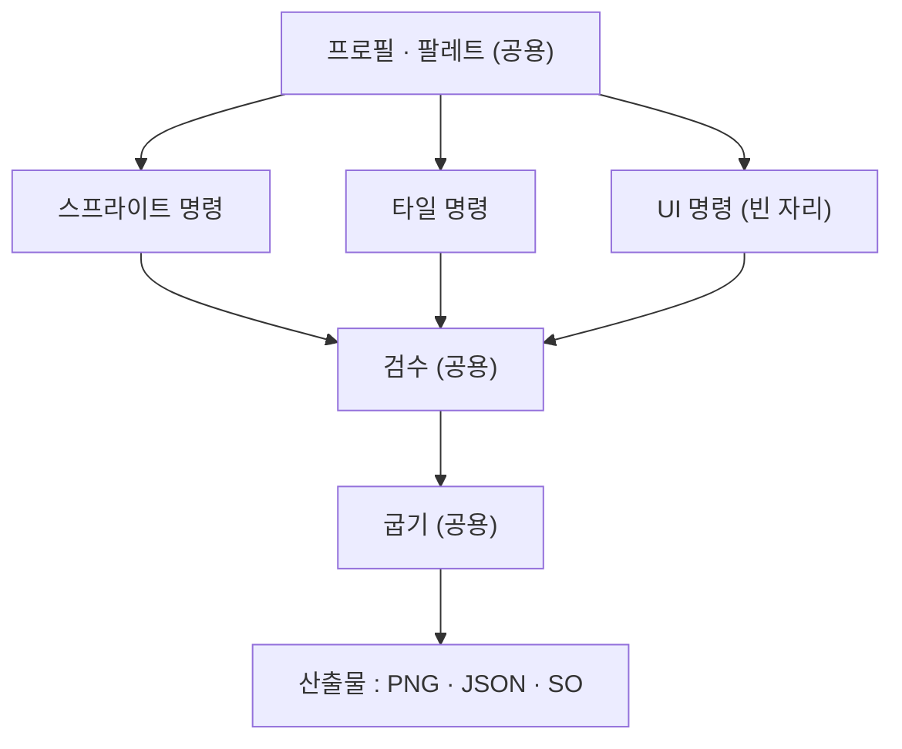
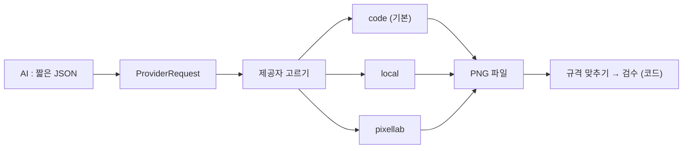
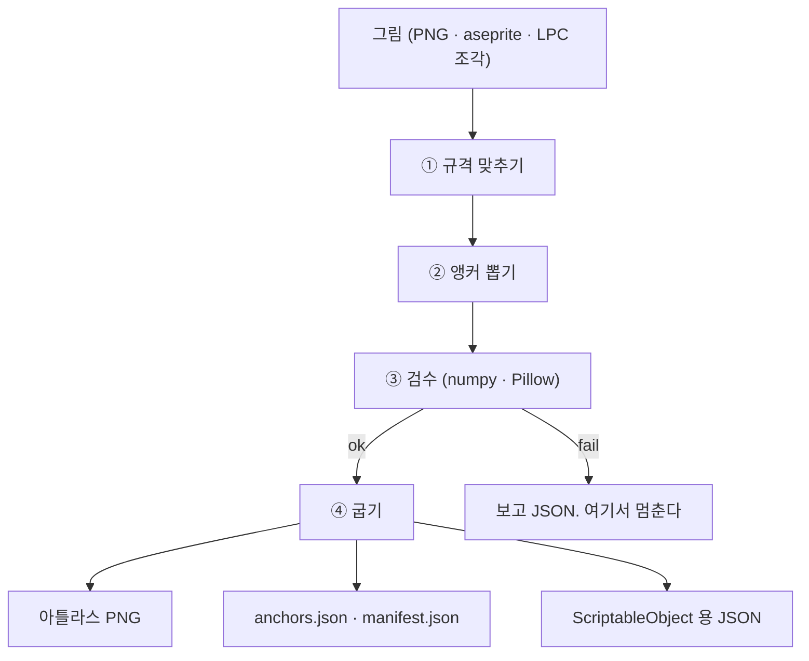

# 그림 툴 설계 — 스프라이트 툴 · 타일 툴

> 입력값 : `Docs/Todo/그림툴.md` 의 "정해진 것", `Docs/Design/2026-08-20-그림툴결정사항.md`, `Docs/Research/` 6장.
> **이미 정해진 것은 뒤집지 않았다.** 바꾸고 싶은 것은 맨 끝 "재검토 제안" 에 적었다.
> 이 문서가 덮는 것 : 할 일 문서 3-1 절의 네 항목 + 파이프라인 · 앵커 형식 · Unity 산출물 · 코드 구조.

## 결론 먼저 (여덟 줄)

1. **툴은 하나, 명령은 여러 개.** 스프라이트 · 타일 · UI 는 폴더가 아니라 **명령어 묶음**으로 가른다.
2. **제공자는 `Provider` 인터페이스 하나.** 기본은 `code`(그림 안 만듦), 선택은 `local`(로컬 모델) · `pixellab`. **키가 없으면 목록에서 아예 빠진다.**
3. **프로필은 YAML, 기계끼리 주고받는 것은 전부 JSON.** 사람이 고치는 파일만 YAML 이다.
4. **파이프라인은 4단** — 규격 맞추기 → 앵커 뽑기 → 검수 → 굽기. 단계마다 **입력·출력이 파일**이라 중간에서 끊어 다시 돌릴 수 있다.
5. **타일은 3단** — ① 타일 그림 ② 이어붙이기(6장 → 47장) ③ 배치(DeBroglie). ②③은 코드다.
6. **앵커는 한 줄 = 한 점.** `{rig, anim, direction, frame, point, x, y, z}` 하나로 사람·슬라임을 다 적는다.
7. **Unity 산출물은 PNG + JSON + ScriptableObject(수치만).** 배선은 코드에 둔다.
8. **Python 3.11 + Pillow + numpy.** 배치(DeBroglie·C#)만 바깥 실행 파일로 부른다.

---

## 1. 툴 경계

### 1-1. 셋의 책임

| 툴 | 다루는 그림 | 하는 일 | 안 하는 일 |
| --- | --- | --- | --- |
| **스프라이트 툴** | 캐릭터 · 프롭 (한 장짜리, 애니메이션 있음) | 규격 맞추기 · 앵커 뽑기 · 층 겹치기 · 검수 · 굽기 | 그림 그리기, 격자 이어붙이기 |
| **타일 툴** | 지형 타일 (격자에 반복해서 깔림) | 부풀리기(6→47) · 배치 · 검수 · 굽기 | 캐릭터, 애니메이션, 앵커 |
| **UI 툴** | 버튼 · 창 · 아이콘 | **경계만 긋는다. 안은 비워 둔다** | — |

가르는 기준은 그림의 종류가 아니라 **무엇이 그림을 이어붙이나** 다.

- 스프라이트 = **시간**으로 이어진다 (프레임). → 프레임 정합·앵커가 문제다.
- 타일 = **공간**으로 이어진다 (이웃 8칸). → 경계 규칙이 문제다.
- UI = **크기**로 늘어난다 (9-slice). → 늘어나는 축과 여백이 문제다. 그래서 앞의 둘과 안 섞인다.

### 1-2. 입출력

| 툴 | 들어오는 것 | 나가는 것 |
| --- | --- | --- |
| 스프라이트 | 낱장 PNG · 스프라이트시트 · `.aseprite` · LPC 조각 | 규격 맞춘 시트 PNG, `anchors.json`, `sprite_manifest.json`, 검수 보고 JSON |
| 타일 | 템플릿 6장 PNG, 팔레트 램프 JSON, 배치 규칙 JSON | 47장 blob PNG, `tileset.json`, LDtk 프로젝트 파일, 검수 보고 JSON |
| UI | (미정) | (미정) |

### 1-3. 셋이 같이 쓰는 것

**프로필 · 팔레트 · 검수 규칙 · 굽기 계층은 공용이다.** UI 툴이 나중에 붙어도 여기는 안 고친다.



---

## 2. 제공자 갈아끼우기

### 2-1. 왜 인터페이스가 필요한가

툴은 그림을 그리지 않는다. 그런데 **가끔 없는 그림을 만들어야 한다** — 베이스 4~5벌, 아이템 낱장, 타일 템플릿 6장. 그 자리만 갈아끼운다. 나머지(규격·앵커·검수·굽기)는 제공자를 안 탄다.

### 2-2. 제공자 셋

| 이름 | 무엇 | 켜지는 조건 | 기본값 |
| --- | --- | --- | --- |
| `code` | 그림을 **안 만든다.** 이미 있는 에셋을 자르고 색만 바꿔 내놓는다 | 늘 켜짐 | ✅ |
| `local` | 미니PC 의 이미지 모델 | 엔드포인트 설정이 있을 때 | — |
| `pixellab` | PixelLab REST/SDK | `PIXELLAB_API_KEY` 가 있을 때 | — |

- **키가 없으면 목록에서 빠진다.** 오류가 아니라 "그 제공자는 없는 것" 이다.
- 사용자가 `--provider pixellab` 을 대놓고 골랐는데 키가 없으면 **그때만 오류**로 멈춘다.
- 키는 **환경변수로만** 읽는다. 프로필 파일·산출물·로그 어디에도 안 적는다.

### 2-3. 계약

```python
class Provider:
    name: str
    def available(self) -> bool: ...              # 키·엔드포인트 확인. 네트워크는 안 건드린다
    def capabilities(self) -> set[str]: ...       # {"character", "rotate", "tile", "skeleton"}
    def make(self, req: ProviderRequest) -> ProviderResult: ...
```

| 칸 | 요청(`ProviderRequest`) | 응답(`ProviderResult`) |
| --- | --- | --- |
| 무엇 | `kind` : character / tile / rotate / skeleton | `images` : PNG 파일 경로 목록 |
| 규격 | `size`, `projection`, `directions`, `frames` | `meta` : 실제 크기·방향·프레임 |
| 재료 | `reference` : 참조 PNG 경로 (없어도 됨) | `provider`, `cost_usd`, `seed` |
| 말 | `prompt` : 짧은 한 줄 | `warnings` : 문자열 목록 |

지켜야 할 규칙 넷 :

1. **응답은 파일 경로다. 툴 안에서 이미지 바이트를 돌려 다니지 않는다.** 중간에서 끊어 다시 돌리려면 파일이어야 한다.
2. **제공자는 검수를 안 한다.** 나온 그림은 무조건 규격 맞추기 → 검수를 다시 탄다. 제공자가 뭐라 하든 믿지 않는다.
3. **AI 가 뱉는 것은 `ProviderRequest` JSON 한 덩이뿐이다.** 픽셀은 제공자 또는 코드가 만든다.
4. **비용은 부르기 전에 계산해서 보여준다.** `--dry-run` 이면 견적만 찍고 안 부른다.



---

## 3. 프로필 설정 파일

### 3-1. 형식은 YAML 로 간다

| 형식 | 좋은 점 | 나쁜 점 | 판정 |
| --- | --- | --- | --- |
| **YAML** | 주석이 된다 · 겹구조가 얕게 보인다 · 앵커 조사 문서가 이미 YAML 로 예시를 썼다 | 파서(PyYAML)를 깔아야 한다 · 들여쓰기 사고 | ✅ **채택** |
| JSON | 파서가 기본 내장 | **주석이 없다.** 프로필은 사람이 읽고 고치는 파일이라 치명적 | 기계끼리만 |
| TOML | 3.11 부터 읽기는 내장 | `rigs.blob.anchors` 같은 **겹구조가 지저분해진다** · 쓰기는 내장이 아니다 | 탈락 |

**갈라 쓴다.** 사람이 고치는 프로필 = YAML. 툴이 주고받는 것(제공자 요청, 앵커, 매니페스트, 검수 보고) = **전부 JSON.** "AI 는 짧은 JSON 만 뱉는다" 원칙과 안 부딪친다.

### 3-2. 프리셋과 덮어쓰기

값이 정해지는 순서다. **뒤가 앞을 이긴다.**

| 순서 | 어디서 | 예 |
| --- | --- | --- |
| 1 | 툴 안에 박힌 기본값 | `frame: [64,64]` |
| 2 | 프리셋 (`preset: topdown_action`) | 투영·방향 수·이동 |
| 3 | 프로필 파일의 내 값 | `palette`, `rigs` |
| 4 | CLI 인자 | `--directions 8` |

프리셋 넷은 키트 공용 결정을 그대로 따른다 — `platformer` · `beltscroll` · `topdown_action`(기본) · `iso`.
**프리셋 정의는 이 툴 폴더 안에 복사해 둔다.** 바깥 폴더를 가리키지 않는다.

### 3-3. 예시 파일 (`profiles/topdown_action.yaml`)

```yaml
# 프로필 = 축 3개 + 그림 규격 + rig. 씬·모드마다 하나씩 둔다.
name: topdown_action
preset: topdown_action        # 축 3개를 여기서 가져온다

axes:                          # 프리셋을 덮어쓰고 싶을 때만 적는다
  projection: quarter          # front | topdown | quarter | isometric
  directions: 4                # 1(좌우 미러) | 4 | 8
  movement: plane              # plane | gravity

canvas:
  frame: [64, 64]
  baseline_y: 50               # 발이 닿는 줄
  center_x: 31.5
  pivot: bottom_center

palette:
  ramp_len: 6                  # LPC 램프 길이
  outline: "#000000"           # 램프에서 뺀다. 같이 바뀌면 실루엣이 흐려진다
  exact_match: true            # 램프에 없는 색이 나오면 오류
  ramps_file: palettes/lpc_cloth.json
  swap: runtime_lut            # runtime_lut | bake | both

anim:                          # 프레임 수. LPC 실측값
  idle:      { frames: 2, dirs: 4 }
  walk:      { frames: 9, dirs: 4 }
  run:       { frames: 8, dirs: 4 }
  jump:      { frames: 5, dirs: 4 }
  spellcast: { frames: 7, dirs: 4 }
  emote:     { frames: 3, dirs: 4 }
  sit:       { frames: 3, dirs: 4 }
  hurt:      { frames: 6, dirs: 1 }

rigs:
  humanoid_lpc:
    method: layer              # 층 겹치기
    layer_order: [body, legs, feet, torso, arms, hair, headwear]
    anchors: []                # LPC 규격에는 앵커가 없다
  blob:
    method: anchor             # 앵커 부착
    parts: [body]
    anchors: [head_top, back, front, ground]
    marker_layer: anchors      # Aseprite 레이어 이름
    marker_colors:
      head_top: "#FF00FF"
      back:     "#00FF00"
      front:    "#00FFFF"
      ground:   "#FF8000"

tiles:
  size: 16
  blob: 47                     # 6장 템플릿 → 47장
  mirror_east_from_west: true  # 방향 하나를 반전으로 아낀다

check:                         # 검수 기준. 넘으면 실패
  max_colors: 48
  allow_alpha: binary          # 반투명 픽셀 금지 (안티에일리어싱 방지)
  baseline_tolerance: 0
  bbox_drift: 1                # 프레임 사이 몸통 흔들림 허용 픽셀
```

---

## 4. 파이프라인

### 4-1. 스프라이트 4단

| 단계 | 입력 | 출력 | 실패 조건 |
| --- | --- | --- | --- |
| ① 규격 맞추기 `normalize` | 낱장·시트 PNG, 프로필 | 프레임 크기·baseline·중심이 맞춰진 시트 PNG | 프레임 수가 프로필과 다름 · 캔버스가 안 맞음 · 반투명 픽셀 발견 |
| ② 앵커 뽑기 `anchors` | ①의 시트, 마커 레이어 또는 `.aseprite` slice | `anchors.json` | 부착점이 프레임에서 빠짐 · 마커가 2개 이상 · 마커 색이 그림 색과 겹침 |
| ③ 검수 `check` | ①②의 산출물, 프로필의 `check` | 검수 보고 JSON (`ok` / `fail` + 항목별 줄) | 색 수 초과 · 램프에 없는 색 · baseline 어긋남 · bbox 흔들림 초과 |
| ④ 굽기 `bake` | ①②③ 전부 통과한 것 | 아틀라스 PNG, `sprite_manifest.json`, SO 용 JSON | 앞 단계 보고가 `ok` 가 아님 |

**④는 ③이 `ok` 일 때만 돈다.** 검수를 건너뛰려면 `--force` 를 대놓고 적어야 하고, 그러면 매니페스트에 `forced: true` 가 박힌다.



### 4-2. 타일 3단

| 단계 | 입력 | 출력 | 실패 조건 |
| --- | --- | --- | --- |
| ① 타일 그림 `tile source` | 기반 에셋(Kenney CC0) 또는 제공자 | 템플릿 6장 PNG | 타일 크기가 프로필과 다름 · 팔레트 밖 색 |
| ② 이어붙이기 `tile blob` | 템플릿 6장 | 47장 blob PNG + `tileset.json` | 템플릿 6장이 안 채워짐 · 조각 경계가 안 맞음 |
| ③ 배치 `tile place` | 47장 blob, 배치 규칙 JSON | 맵 JSON → LDtk 프로젝트 | 규칙이 모순이라 WFC 가 못 풀림(수축) · 시간 초과 |

- ②는 **쿼터 타일**로 짠다. 한 칸을 네 조각으로 쪼개면 조각당 경우의 수가 8가지뿐이라 규칙이 짧아진다.
- ③은 **DeBroglie(MIT, C#)** 를 바깥 실행 파일로 부르고 **표준입출력 JSON** 으로 주고받는다. 파이썬 안으로 끌어들이지 않는다.
- ①은 제공자를 타는 **유일한 타일 단계**다. `code` 제공자면 기반 에셋에서 잘라 온다.

---

## 5. 앵커 데이터 형식

**한 줄 = 한 점.** rig 가 달라도 형식은 같다.

```json
{
  "version": 1,
  "profile": "topdown_action",
  "frame": [64, 64],
  "points": [
    { "rig": "blob", "anim": "walk", "direction": "south", "frame": 0,
      "point": "head_top", "x": 48, "y": 18, "z": 10 },
    { "rig": "blob", "anim": "walk", "direction": "north", "frame": 0,
      "point": "head_top", "x": 14, "y": 17, "z": -10 }
  ]
}
```

| 칸 | 뜻 | 규칙 |
| --- | --- | --- |
| `rig` | 몸 구조 | 프로필의 `rigs` 키 중 하나 |
| `anim` · `direction` · `frame` | 어느 그림인지 | 넷이 합쳐서 열쇠. 같은 열쇠에 같은 `point` 가 두 번 나오면 오류 |
| `point` | 부착점 이름 | 프로필의 `anchors` 목록에 있어야 한다 |
| `x` · `y` | 위치 | **프레임 왼쪽 위 기준 정수 픽셀.** 0~1 정규화는 안 쓴다 (반올림 사고 방지) |
| `z` | 앞뒤 순서 | 음수면 몸 뒤, 양수면 몸 앞. **프레임마다 바뀔 수 있다** |

정한 것 :

- **정수 픽셀로 저장한다.** PixelLab `estimate-skeleton` 은 0~1 float 을 주므로 **들여올 때 반올림**하고, 반올림 오차는 그때 한 번만 생기게 한다.
- **`z` 는 프레임마다 적는다.** 슬라임 왕관이 남쪽에서는 몸 앞, 북쪽에서는 몸 뒤로 가야 한다.
- **east 를 west 반전으로 만들 때 `x` 도 같이 뒤집는다** (`x' = frame_w - 1 - x`). 프로필의 `mirror_east_from_west` 가 켜져 있으면 툴이 자동으로 넣는다.
- **Aseprite slice 와 상호 변환한다.** slice 의 `pivot` 이 곧 `x`·`y`, slice 이름이 `point` 다. 사람이 손보는 자리를 Aseprite 로 열어야 하기 때문이다.

---

## 6. Unity 쪽 산출물

| 산출물 | 무엇 | 왜 이 꼴인가 |
| --- | --- | --- |
| 아틀라스 PNG + `.meta` 용 슬라이스 JSON | 잘린 스프라이트 | 엔진이 바로 읽는다 |
| `sprite_manifest.json` | 프레임 ↔ 애니메이션 ↔ 방향 표 | 코드가 읽어서 클립을 만든다 |
| `anchors.json` | 5절 형식 그대로 | **런타임 부착.** 미리 구우면 조합이 터진다 |
| `PaletteRampAsset` (ScriptableObject) | 램프 색 배열만 | **수치 데이터 통.** 이벤트 배선은 안 넣는다 |
| `SpriteSpecAsset` (ScriptableObject) | 프레임 크기·baseline·방향 수 | 〃 |
| LUT 텍스처 PNG | 팔레트 스왑용 | 런타임 셰이더가 읽는다 |
| LDtk 프로젝트 파일 | 타일맵 | **LDtkToUnity**(MIT)로 가져온다 |

지킬 것 :

- **설정과 연결은 코드에 둔다.** 인스펙터에서만 알 수 있는 배선을 만들지 않는다. AI 가 인스펙터를 못 본다.
- ScriptableObject 는 **수치만.** "어느 스프라이트를 어느 슬롯에" 같은 배선은 매니페스트 JSON 을 코드가 읽어 붙인다.
- 굽기 산출물은 전부 **한 폴더 아래**에 모으고, 폴더 이름·네임스페이스는 프로필에서 받는다. 게임마다 다르다.

---

## 7. 코드 구조 초안

### 7-1. 언어는 Python 3.11+

| 근거 | 내용 |
| --- | --- |
| 검수가 이미 Python 으로 정해짐 | numpy · Pillow 로 한다는 결정이 있다 |
| PixelLab | 공식 **Python SDK** 가 있다. 조사에서 소스까지 확인했다 |
| Aseprite | CLI 라 어느 언어에서든 부른다. 제약 아님 |
| 붙일 곳 | 대상 게임 프로젝트에 **폴더 하나 + `pip install -e .`** 로 붙는다. 엔진과 안 엮인다 |
| 예외 | 배치(DeBroglie)만 C# 이라 **바깥 실행 파일**로 부른다 |

### 7-2. 패키지

```
ArtTool/
  pyproject.toml
  src/arttool/
    cli.py           # 명령 등록만
    profile.py       # YAML 읽기 · 프리셋 겹치기 · 값 검사
    palette.py       # 램프 · LUT · 정확일치 스왑
    image.py         # Pillow/numpy 감싸기. 다른 모듈은 Pillow 를 직접 안 쓴다
    check.py         # 검수 규칙 하나당 함수 하나
    bake.py          # 아틀라스 · 매니페스트 · SO JSON
    sprite/
      normalize.py   # ① 규격 맞추기
      anchors.py     # ② 앵커 뽑기 (마커 · slice · skeleton)
      layers.py      # LPC 층 겹치기
      aseprite.py    # Aseprite CLI 감싸기
    tiles/
      blob.py        # ② 6장 → 47장
      place.py       # ③ DeBroglie 부르기
      ldtk.py        # LDtk 파일 쓰기
    providers/
      base.py        # Provider 인터페이스 · 등록소
      code.py        # 기본. 그림 안 만듦
      local.py
      pixellab.py
  profiles/          # 프리셋 넷 + 예시 프로필
  palettes/          # 램프 JSON
  Docs/  Example/
```

원칙 셋 :

- **`cli.py` 에는 로직을 안 둔다.** 인자를 파싱해서 함수를 부르기만 한다. 그래야 라이브러리로도 쓴다.
- **Pillow 는 `image.py` 안에서만 부른다.** 나중에 갈아끼울 여지를 남긴다.
- **`providers/` 밖에서는 제공자 이름을 모른다.** `code` 라는 문자열이 `sprite/` 안에 나오면 잘못이다.

### 7-3. 명령 꼴

```
arttool profile show   --profile topdown_action
arttool normalize      --profile P --in raw/ --out build/frames/
arttool anchors        --profile P --in build/frames/ --rig blob --from marker --out build/anchors.json
arttool check          --profile P --in build/ --report build/check.json
arttool bake           --profile P --in build/ --out Unity/Art/ --namespace Game.Art
arttool tile blob      --profile P --in tiles/template6/ --out build/tiles47/
arttool tile place     --profile P --rules rules.json --size 64x64 --out build/map.ldtk
arttool provider list
arttool provider make  --kind character --spec req.json --dry-run
```

공통 인자 : `--profile` · `--provider` · `--dry-run` · `--force` · `--json`(사람용 표 대신 JSON 출력).
**툴킷이므로 Officina 전용 경로·이름을 코드에 박지 않는다.** 폴더는 전부 인자로 받는다.

---

## 8. 못 정한 것 · 설치 필요한 것

### 8-1. 못 정한 것 (할 일 문서 5절을 이어받음)

| 항목 | 왜 지금 못 정하나 | 언제 정해지나 |
| --- | --- | --- |
| Qwen + 이미지 모델을 같이 올릴 수 있나 | 미니PC 64GB 공유 메모리, AI 몫 약 48GB. 둘의 합을 재봐야 안다 | 미니PC 도착 후 |
| PixelLab MCP 토큰 비용 | 붙여봐야 안다 | 붙일 때 |
| `estimate-skeleton` 의 64×64 실제 정확도 · 프레임 간 떨림 | 실제 호출을 안 해봤다 | 첫 베이스 생성 때 |
| 슬라임 회전(`rotate` / `generate-8-rotations`) 품질 | 확인 못 했다 | 슬라임 4방향 만들 때 |
| 텍스처 합성 | 후보가 라이선스 없거나 보관됨. 우선순위 낮음 | 미뤘다 |
| **`local` 제공자의 실제 모델** | 아직 후보를 안 골랐다 | Qwen 메모리 계산 뒤 |
| **DeBroglie 를 어떻게 배포하나** | .NET 런타임을 키트가 요구할지, 미리 빌드한 실행 파일을 넣을지 | 타일 ③단 만들 때 |
| **UI 툴 안쪽** | 조사 전 | 조사 후 |

### 8-2. 설치가 필요한 것 (**설치하지 않았다. 승인 필요**)

| 무엇 | 왜 | 대안 |
| --- | --- | --- |
| **Pillow** | 그림 합성·검수 | 없음. 필수 |
| **numpy** | 검수 계산 | 없음. 필수 |
| **PyYAML** | 프로필 읽기 | 프로필을 JSON 으로 내리면 안 써도 된다 (주석을 잃는다) |
| **Aseprite** | slice 추출 · 마커 레이어 뽑기 | 스팀판 보유. 이 PC 에 미설치. 없으면 PNG 마커 경로만 쓴다 |
| **.NET 런타임** | DeBroglie 실행 | 미리 빌드한 실행 파일을 넣으면 필요 없을 수도 |
| PixelLab SDK | 선택 제공자 | 없으면 그 제공자만 꺼진다 |

---

## 9. 재검토 제안 (**바꾸지 않았다. 판단만 받는다**)

| 제안 | 지금 결정 | 왜 다시 볼 만한가 |
| --- | --- | --- |
| 프로필을 JSON 으로 통일 | YAML(사람) + JSON(기계) | 형식이 둘이면 파서도 둘이다. PyYAML 을 못 깔면 JSON 하나로 가는 게 낫다 |
| `spellcast` 를 범용 액션으로 쓰는 것 | 그렇게 정함 | 이름이 뜻과 안 맞아 나중에 헷갈린다. `action` 으로 이름만 바꾸는 게 나을 수 있다 |
| 앵커 `z` 를 정수로 둘 것인가 | 정수 | Unity `sortingOrder` 가 정수라 맞다. 다만 층이 늘면 간격을 미리 벌려둬야 한다(10 단위 권장) |
| 타일 크기 16 | 그렇게 씀 | 캐릭터가 64×64 인데 타일이 16이면 축척이 안 맞아 보일 수 있다. 32 가 나을지 실물로 봐야 안다 |

---

## 부록 : 이 설계가 따르는 앞선 결정

| 결정 | 어디서 왔나 |
| --- | --- |
| 툴은 그림을 안 그린다. 규격·앵커·검수·굽기만 | `Design/2026-08-20-그림툴결정사항.md` |
| AI 는 짧은 JSON 만, 결과물과 검수는 코드 | 〃 (mem `20260822-0fde5d9b`) |
| 제공자 갈아끼우기 · 유료는 선택 · 라이선스 셋 | mem `20260822-62b5077a` |
| rig 로 부착 방식을 가른다 (LPC 층 / 앵커) | `Research/2026-08-20-앵커부착방식조사.md` |
| 6장 → 47장 blob, DeBroglie · LDtkToUnity 만 갖다 씀 | `Research/2026-08-20-배경툴후보검증.md` |
| 축 3개 + 프리셋 넷, 캔버스 64×64 | 키트 공용 결정 (프로젝트 개요) |
